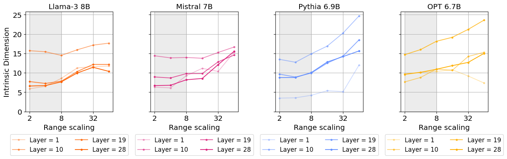
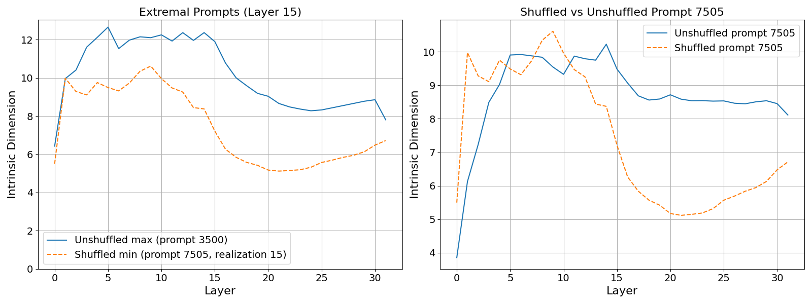
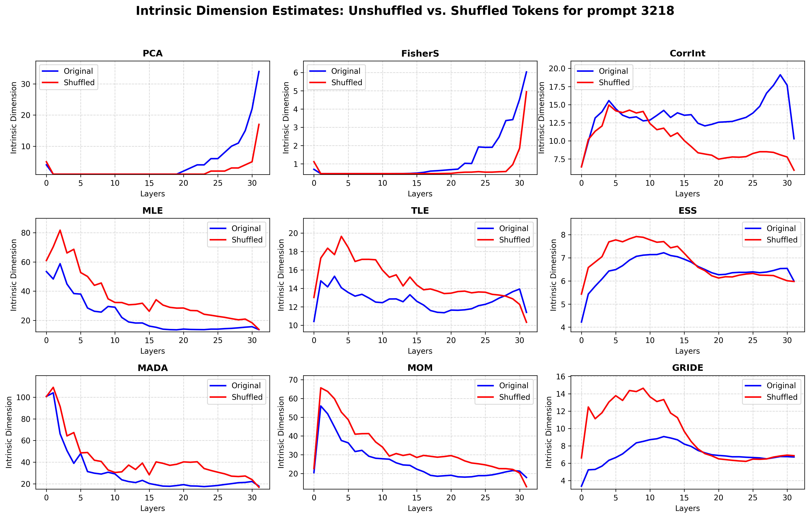

# Rebuttal Plots

## Shuffling consistency check
Here, we perform two checks
1. Is the higher shuffled ID an artifact of noise? We perform the scale analysis for the shuffled prompts and show that they plateau around scaling = 4
2. When would a shuffled prompt be expected to show a lower ID than the normal sentence? We check for samples where this happens
### 1. Scale analysis for shuffled prompts ([Jupyter Notebook](../scale_analysis.ipynb))

### 2. Example of shuffled ID < unshuffled ID
For the analysis here, we use LLama 3 8B. 

#### TAKEAWAY: At layer 15, prompt 3500 has a high normal ID and prompt 7505 has a lower shuffled ID. Document 3500 is a list of names and Document 7505 carries more context, thereby providing an example where Unshuffled ID (3500) > Shuffled ID (7505). We also see that the difference between the unshuffled ID of prompt 7505 is not very different from its shuffled counterpart in the early layers.

## Comparison with other estimators for PROMPT 3218 ([Jupyter Notebook](../comparison_other_estimators.ipynb))
For the analysis here, we use LLama 3 8B. 

We notice that TLE, ESS and GRIDE estimators have a similar ID profile across layers.
Another important factor is the computational advantage of GRIDE since the full experiment involves running across a large number (2244) of prompts.
Here is a table with the summary of number of point clouds processed per second.
| Estimator | GRIDE | MOM  | MLE  | CorrInt | ESS  | PCA  | FisherS | TLE  | MADA |
|-----------|-------|------|------|---------|------|------|---------|------|------|
| Samples/sec (avg) | 30.82 | 14.06 | 13.53 | 6.16    | 2.97 | 1.24 | 1.21    | 1.16 | 0.92 |

