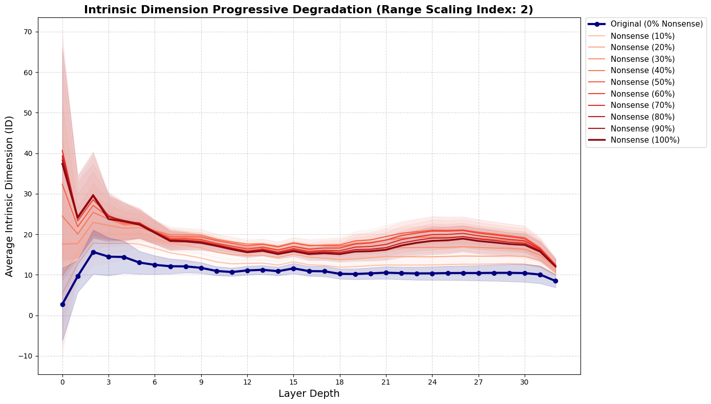
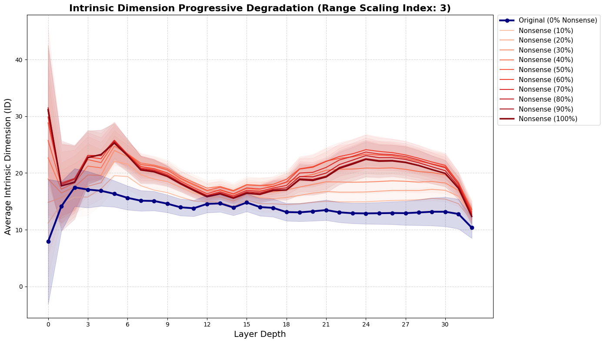
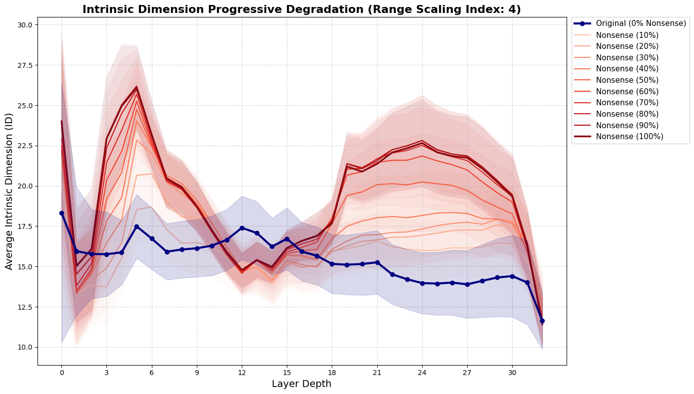
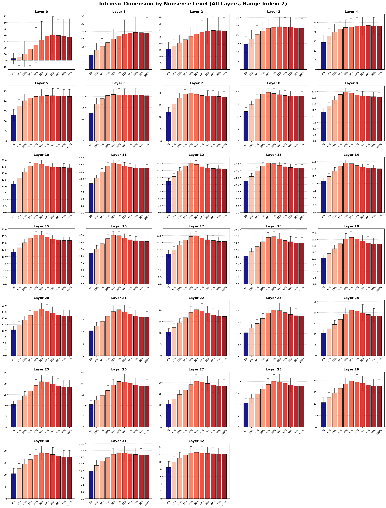
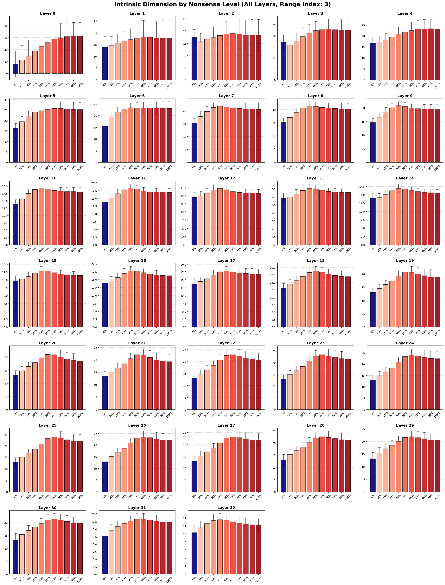
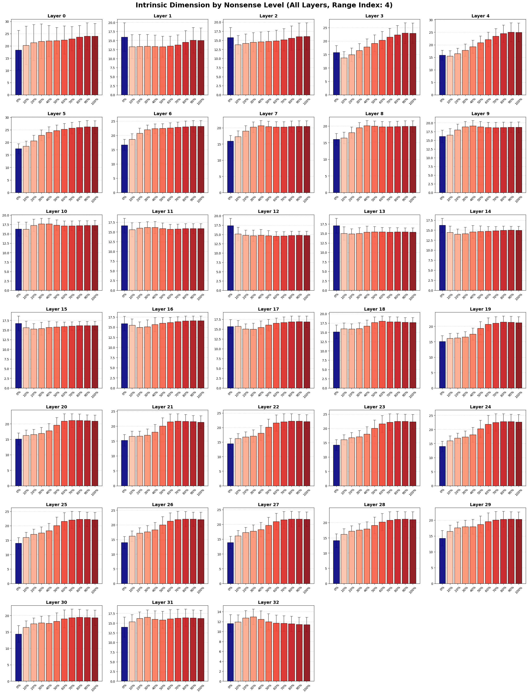

### Rebuttal TMLR 

#### Tables 
We run the weighted log prob variance and reproduce the results for the Table 2 and 3 of the paper.
#####  Weighed Log Prob Variance

additional results for Table 2

| Dataset | accuracy |
|---|---|
| **MALICIOUS** | 0.97 |
| **JAILBREAK** | 0.67 |
| **ATTACK** | 0.97 |

additional results for Table 3

| Dataset | 100-200 | 200-300 | 300-400 | 400-500 | 500-600 |
|---|---|---|---|---|---|
| **MALICIOUS** | 0.92 | 0.94 | 0.97 | 0.96 | 0.96 |
| **JAILBREAK** | 0.64 | 0.68 | 0.61 | 0.70 | - |
| **ATTACK** | 0.95 | 0.96 | 0.98 | 0.97 | 0.96 |

#### Plots

Intrinsic Dimension computed with GRIDE on different levels of "Nonsense" where we define as Nonsense the change of X% of words of the sentence to random words. The following plots represents also the different range scalings.

##### Range scaling 2
 
##### Range scaling 3
 
##### Range scaling 4
 

Bar plots 

##### Range scaling 2
 
##### Range scaling 3
 
##### Range scaling 4
 

