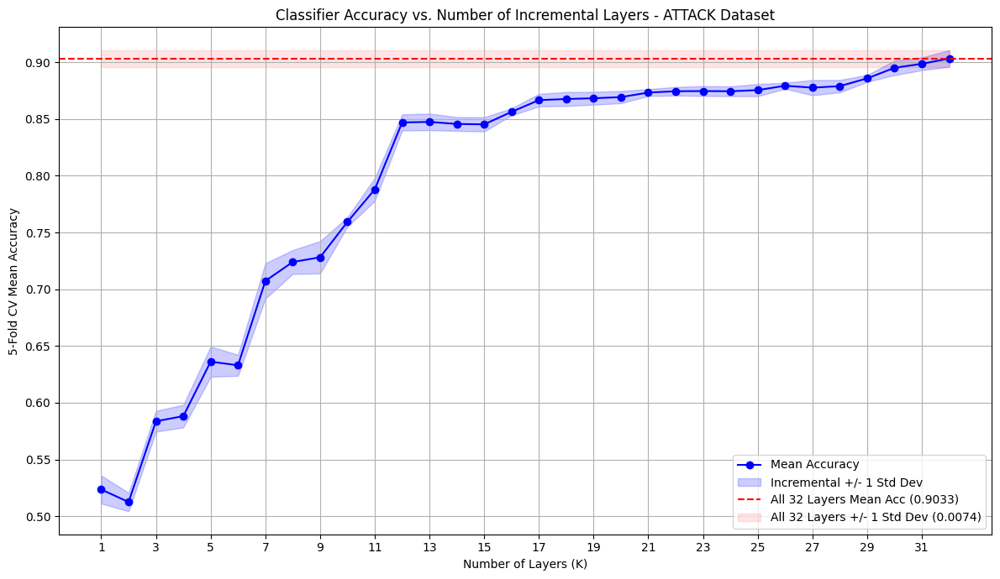
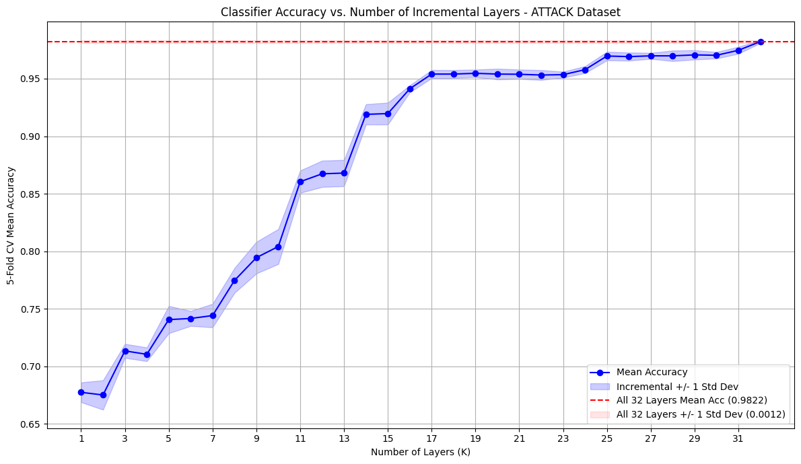

# Quantifying Semantic Disruption in Token Shuffling

## Experiment

To calibrate the semantic impact of our shuffling methodology, we computed BLEU and BERTScore metrics comparing shuffled prompts to their original versions. The analysis uses 50 prompts from Pile-10K with the Llama-3-8B tokenizer.

Our shuffling operates at 6 degrees (0-5) where block size = 1024 / (4^index):
- **Index 0**: No shuffling (block size = 1024 tokens)
- **Index 5**: Complete shuffling (block size = 1 token)

## Results

| Shuffle Index | BLEU [mean (std)] | BERTScore F1 [mean (std)] |
|----------------|-------------------|---------------------------|
| 0 (none)       | 1.00 (0.00)       | 1.00 (0.00)              |
| 1              | 0.99 (0.00)       | 0.90 (0.05)              |
| 2              | 0.97 (0.01)       | 0.88 (0.03)              |
| 3              | 0.86 (0.04)       | 0.86 (0.03)              |
| 4              | 0.42 (0.11)       | 0.81 (0.02)              |
| 5 (full)       | 0.03 (0.06)       | 0.76 (0.03)              |

The results show a consistent drop in both BLEU and BERTScore across shuffle degrees. BLEU drops from 1.00 to 0.03, while BERTScore decreases from 1.00 to 0.76, quantifying the semantic disruption caused by token shuffling at each degree.

## Shorter prompts
| Classifier on GRIDE | 100-200 | 200-300 | 300-400 | 400-500 |
| :--- | :--- | :--- | :--- | :--- |
| **malicious** | 0.79 ± 0.015 | 0.85 ± 0.0262 | 0.87 ± 0.0053 | 0.91 ± 0.102 |
| **jailbreak** | 0.60 ± 0.0105 | 0.68 ± 0.0056 | 0.59 ± 0.0225 | 0.68 ± 0.0109 |
| **attack** | 0.89 ± 0.0093 | 0.89 ± 0.0076 | 0.89 ± 0.0032 | 0.88 ± 0.0074 |

| Classifier on Entropy | 100-200 | 200-300 | 300-400 | 400-500 |
| :--- | :--- | :--- | :--- | :--- |
| **malicious** | 0.97 ± 0.0049 | 0.98 ± 0.003 | 0.97 ± 0.0029 | 0.97 ± 0.0037 |
| **jailbreak** | 0.94 ± 0.0305 | 0.93 ± 0.0736 | 0.88 ± 0.1632 | 0.98 ± 0.0219 |
| **attack** | 0.96 ± 0.0049 | 0.97 ± 0.0030 | 0.97 ± 0.0029 | 0.97 ± 0.0037 |

## Internal Representations
### Gride classifier with increasing number of layers K - ATTACK dataset

### Entropy classifier with increasing number of layers K - ATTACK dataset 

