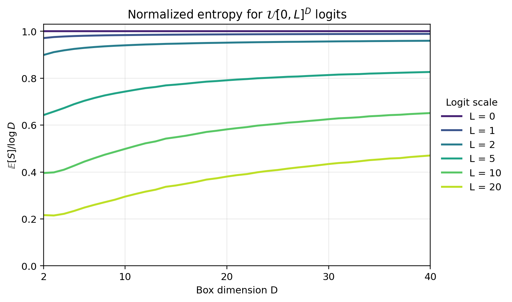
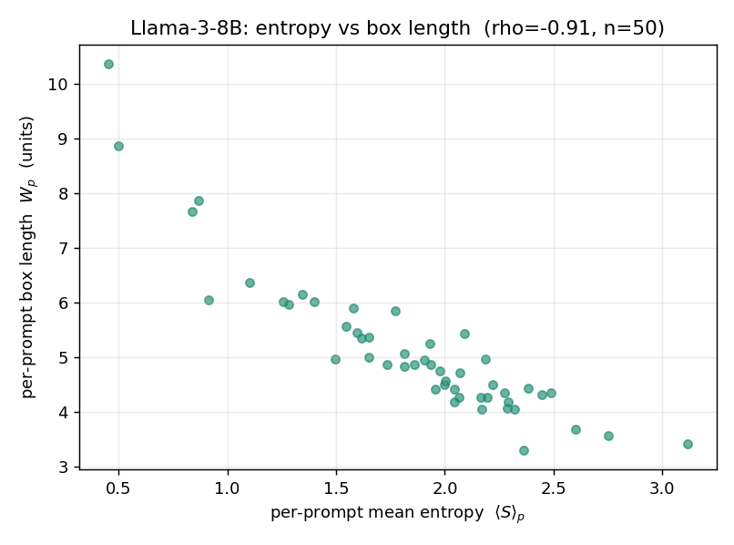
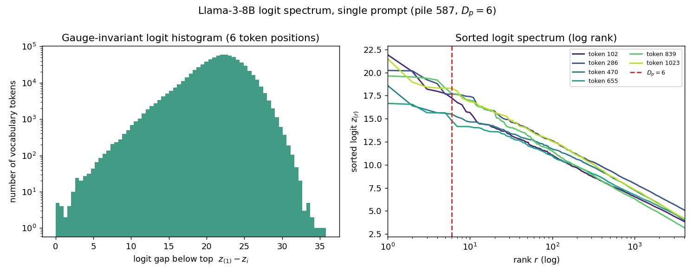

# Deeper analysis of the link between intrinsic dimension and entropy

We previously interpreted the positive correlation between prompt-level intrinsic dimension and entropy using a flat Dirichlet distribution model for the next-token probability vector. This gives an analytically tractable baseline because its expected entropy can be computed explicitly and increases logarithmically with the number of effective coordinates, i.e. $\langle S \rangle_{\Delta_{\mathcal{D}_{\mathcal M}}} \sim \log \mathcal{D}_{\mathcal M} $.

Some limitations of using the flat Dirichlet distribution are:
- It models probabilities directly, while language models first produce logits and then map them to probabilities through the softmax.
- It does not account for the complexity of the logit distribution in language models like logit scale, anisotropy, or the density of points on the logit manifold.
- The relation $\langle S \rangle_{\Delta_{\mathcal{D}_{\mathcal M}}} \sim \log \mathcal{D}_{\mathcal M}$ suggests a unit slope between expected entropy and log effective dimension. This is useful as a baseline, but it need not hold when the logits have a nontrivial scale or sampling distribution.

To make this correction explicit, we analyse a simple yet tractable distribution in logit space. We consider logits sampled uniformly from a $D$-dimensional box of side length $L$, written as $\mathcal{U}[0,L]^D$. This introduces an explicit scale parameter in logit space and allows us to study how the entropy changes as the box size $L$ varies.

This model refines the flat Dirichlet distribution baseline by moving the analysis to logit space. It shows that even at fixed effective dimension, changing the scale $L$ of the logit box can reduce the normalized entropy.

## Revisiting the setup in Section 5

For a prompt of length $N$, the logits form a matrix $Z\in\mathbb{R}^{N\times |V|}$, with token-level logit vectors $\mathbf z_i\in\mathbb{R}^{|V|}$. In Section 5, the manifold $\mathcal M$ is the space of these token-level logit vectors, so the integral is over $\mathbf z\in\mathbb{R}^{|V|}$, not over the full prompt-level matrix. If $\mu$ is a measure on $\mathcal M$, $P(\mathbf{z})$ is the density of logits on this manifold, and $S(\mathbf{z})$ is the softmax entropy of the logit vector, then the expected softmax entropy is

$$
\langle S\rangle_{\mathcal M} =  \int_{\mathcal M} d \mu(\mathbf{z})\; P(\mathbf{z}) S(\mathbf{z}).
$$

The flat Dirichlet distribution calculation makes this relation explicit in a special case where the probability vector is sampled from a probability simplex of dimension $\mathcal{D}_{\mathcal M}$. In the asymptotic limit, the expected entropy is

$$
\lim _{{\mathcal{D}_{\mathcal M}} \rightarrow \infty} \langle S\rangle_{\Delta_{\mathcal{D}_{\mathcal M}}} = \log \mathcal{D}_{\mathcal M} + \gamma - 1 \sim \log \mathcal{D}_{\mathcal M} - 0.42
$$

This gives the logarithmic dependence on effective dimension used in the flat Dirichlet distribution baseline. We now move to a logit-space model and study the case where logits are sampled from a $D$-dimensional box of side length $L$.

## Entropy for logits sampled from a $D$-dimensional box

As a tractable logit-space model, assume that the logits are uniformly distributed in a box of side length $L$. More concretely, each coordinate is distributed as

$$
z_\alpha \overset{\text{i.i.d.}}{\sim} \mathrm{Unif}\left[0,L\right],
\qquad \alpha=1,\ldots,D .
$$

This model has two parameters with distinct meanings:

- $D$ is the number of active softmax coordinates.
- $L$ is the logit scale, i.e. the size of the box.

For the uniform box distribution, this expectation can be written explicitly as an integral over the box:

$$
\langle S\rangle_{\mathcal{U}[0,L]^D}
= \frac{1}{L^D}\int_{[0,L]^D} S(\mathbf{z})\,d\mathbf{z}.
$$

Equivalently, using the softmax entropy explicitly,

$$
\langle S\rangle_{\mathcal{U}[0,L]^D}
= \frac{1}{L^D}\int_{[0,L]^D}
\left[
\log\sum_{\alpha=1}^{D} e^{z_\alpha}
- \frac{\sum_{\alpha=1}^{D} z_\alpha e^{z_\alpha}}
{\sum_{\alpha=1}^{D} e^{z_\alpha}}
\right]d\mathbf{z}.
$$

The scale dependence can be visualized directly by Monte Carlo sampling from the uniform box distribution. We fix the logit scale and vary $D$:

  

*Monte Carlo estimate of $\langle S\rangle/\log D$ as a function of $D=2,\ldots,40$ for fixed $L\in\{0,1,2,5,10,20\}$. For each plotted $(D,L)$ pair, the estimate uses $20{,}000$ independent samples from $\mathcal{U}[0,L]^D$. The maximum normalized standard error across all plotted pairs is $0.25\%$.*

For small $L$, the entropy remains close to the Dirichlet baseline, with $\langle S\rangle/\log D \sim 1$ at $L=0$ and $L=1$. 
Beyond the Dirichlet comparison, this plot shows the role of logit scale $L$. At a fixed dimension, larger $L$ concentrates the softmax distribution and lowers entropy, i.e., $\langle S\rangle_{\mathcal{U}[0,L]^D}$ decreases with $L$ while increasing with $D$. While we can expect $\langle S\rangle$ to be positively correlated to $\log D$ at comparative ranges of $L$, we also see that this model paints a more nuanced picture than the flat Dirichlet distribution.

### Logits in a low-dimensional box embedded in vocabulary space

Here we interpret $D$ as the number of active directions in the vocabulary, not necessarily the full vocabulary size $|V|$. This is the bridge to intrinsic dimension: the relevant dimension is the number of directions that produce significant logit values under the unembedding map.

### Empirical check on Llama-3-8B

We test this picture on Llama-3-8B ($|V| = 128{,}256$). Using the $50$ Pile prompts in `subset_indices.npy` ($1024$ tokens each), we measure how much of the full next-token distribution is accounted for by the top $D_p$ logits, i.e. by keeping only as many logits as the intrinsic dimension, where $D_p$ is the intrinsic dimension of prompt $p$, estimated by GRIDE on its per-token logit cloud. 

#### How many top logits are required to approximate the next token prediction?
Keeping just the top-$D_p$ logits accounts for most of the probability mass but only about half of the entropy: probability concentrates on the few competing directions, while the remaining entropy leaks into the long tail of $\sim\!10^5$ near-zero-probability tokens.

| Logits kept | Probability mass | Entropy |
|---|---|---|
| top-$1$ | $58.5\%$ | $11.9\%$ |
| top-$3$ | $75.0\%$ | $29.7\%$ |
| **top-$D_p$ (per-prompt, mean $7$)** | $\mathbf{84.0\%}$ | $\mathbf{45.8\%}$ |
| top-$16$ | $89.4\%$ | $58.7\%$ |
| top-$32$ | $92.8\%$ | $68.7\%$ |
| top-$128$ | $96.9\%$ | $83.5\%$ |

*Fraction of the full-softmax probability mass and of the entropy captured by the top-$k$ logits, considering all the tokens in the dataset. The bold row keeps each prompt's own $k=\mathrm{round}(D_p)$.*

The concentration of probability mass on the top-$D_p$ logits supports approximating the logit vector by $D_p$ active competing coordinates, as in the $\mathcal{U}[0,L]^{D}$ box. The entropy, however, is not fully captured by these $D_p$ coordinates: about half of it lives in the long tail, which a box with only $D_p$ active coordinates does not represent. We return to this point in the [limitations](#limitations-and-future-work).

#### Understanding the effect of the box length of prompts 

To connect to the uniform box distribution $\mathcal{U}[0,L]^{D}$ of the previous section, we read off both of its parameters from these top logits: the box dimension is $D_p$ itself, and the box length is the span between the largest and the $D_p$-th largest logit, the empirical analogue of the side length $L$ of the $\mathcal{U}[0,L]^{D}$ box. We define it at two levels:

- *Per token.* For a token at position $t$ in prompt $p$, with logits sorted descending $z_{(1)}(t) \ge z_{(2)}(t) \ge \dots$, the box length is $W_t = z_{(1)}(t) - z_{(D_p)}(t)$.
- *Per prompt.* The box length of prompt $p$ is the average over its $N_p$ tokens, $W_p = \frac{1}{N_p}\sum_{t \in p} W_t$.

Across the $50$ prompts, the mean per-token box length is about $5.13$ units, and we correlate the per-prompt box length $W_p$ with the per-prompt mean entropy $\langle S\rangle_p$.

| Box-length statistic | Value |
|---|---|
| mean $W_p$ | $5.13$ units |
| $\rho(W_p,\, \langle S\rangle_p)$ | $-0.91$ (Spearman) |

*Logit-box length on Llama-3-8B. The mean is over the per-token values $W_t$ (aggregated across all tokens of the $50$ prompts); the correlation is computed across the $50$ per-prompt values $W_p$ against the per-prompt mean entropy $\langle S\rangle_p$.*

  

*Llama-3-8B final layer, $50$ Pile prompts. Each point is one prompt: per-prompt mean entropy $\langle S\rangle_p$ versus per-prompt box length $W_p$ ($\rho = -0.91$). Prompts with a wider logit box have lower entropy, consistent with the signature of the scale parameter $L$.*

The box length and the mean entropy are strongly anti-correlated, $\rho(W_p, \langle S\rangle_p) = -0.91$ (Spearman). This is the sign predicted by the uniform box distribution, and the same relationship holds across real prompts, where those with wider logit boxes have lower entropy.

All figures and numbers in this section are produced by [scripts/analyze_logit_spectrum_llama.py](reviews/theoretical-analysis/scripts/analyze_logit_spectrum_llama.py) (one forward pass per prompt; numbers in `outputs/summary.json`).

### Limitations and future work

Putting the two measurements together, the empirical picture on Llama-3-8B supports the reading of the uniform box distribution, while also showing where the model is only an approximation, albeit an improvement over the flat Dirichlet model.

**The logit spectrum is not "top-$D_p$ active plus an inactive remainder."** While most of the mass sits in the top few logits, only about half of the entropy does; the rest is spread over the long tail. The figure below makes the shape explicit: the ordered logit spectrum decays smoothly, close to log-linear in rank over several decades, with $D_p$ sitting on a continuous slope rather than at a cliff. The histogram of $z_{(1)} - z_i$ is a single broad band rather than a clean active/inactive split.

  

*Single Llama-3-8B prompt (pile index $587$, $D_p = 6$). Left: histogram of the logit gaps below the top logit, $z_{(1)} - z_i$, aggregated over the full vocabulary at six token positions, with a log count ($y$) axis. Right: the sorted logit spectrum $z_{(r)}$ against rank $r$ on a log axis, with the intrinsic dimension $D_p$ marked. The spectrum is a smooth, continuous decay; the cutoff at $r = D_p$ falls on the slope, not at an edge of a flat region.*

The uniform box distribution, with $D$ active coordinates of comparable size and all remaining coordinates treated as negligible, captures the mass concentration and the scale dependence, but not the entropy held in the tail. The natural next step is to model the full shape of the logit spectrum, the density and decay of the ordered logits, and hence the tail's contribution to entropy, rather than summarizing each prompt by a single cutoff at rank $D_p$ and a single scale $L$.

